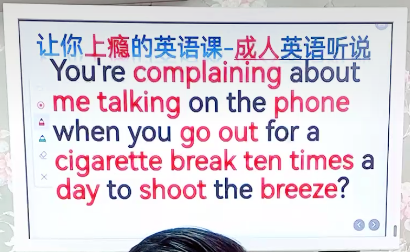
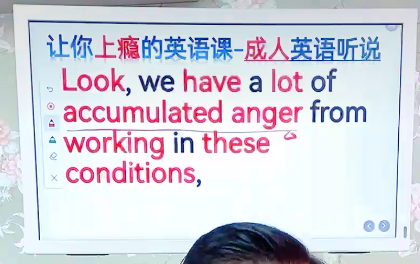

- spyware：间谍软件
- trojans： 木马病毒
- cut out sth. 停止做某事
- drive sb. crazy 把xx逼疯了
- slurp：吸溜，啜吸

- complain：抱怨
- go out for a cigarette break：抽烟休息
- shoot the breeze：闲聊

- accumulated anger：积怨

- let off steam：发泄
- once in a while：偶尔一次

- keep it up：持续

- forgive and forget：让事情过去

- call a truce：休战，讲和

- considerate：体谅的
- keep the noise down： 降低噪音 

- I was wondering（过去进行时表委婉）
- go out to(for) dinner Friday night?
